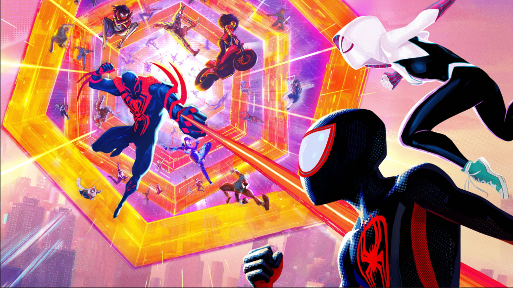

<div align="center">



<br>


<br>

<a href="https://github.com/Sushantaman108Durgadas">

</a>
<a href="https://www.linkedin.com/in/suyash-shirsat-771476335/">

</a>
<a href="mailto:suyashshirsat8@gmail.com">

</a>

</div>

---

# 🕷️ EARTH-616 // SUYASH SHIRSAT

> *"Anyone can wear the mask. You could wear the mask."*

I'm **Suyash Shirsat**, an Electronics & Telecommunication engineering student interested in the point where **hardware, software, signals and communication systems** meet.

I use this profile as a record of things I have **actually built, studied and experimented with** — not a list of technologies I have simply put on a resume.

The Spider-Verse is the theme.

The engineering is real.

---

## 🕸️ MY SPIDER VARIANTS

Different domains. Same engineer.

| 🕷️ Variant | Dimension | What it represents |
|---|---|---|
| 🖤 **Spider-Noir** | Low-Level Systems | C, C++, pointers, memory, file operations, Linux and systems thinking |
| 🔴 **Miles Morales** | Embedded / IoT | ESP32, STM32, sensors, MQTT, Modbus and real-world data acquisition |
| 🔵 **Peter Parker** | Electronics / Networks | Electronics fundamentals, communication, TCP/IP and connected systems |
| 🦾 **Spider-Man 2099** | Digital Hardware | FPGA, Verilog, VHDL and digital logic |
| 🧠 **Spider-Byte** | Signals / Vision | DSP, image processing, machine vision and ML experiments |
| 🎸 **Spider-Punk** | Experimental Builds | Projects where hardware, software and creative design collide |

---

# ⚙️ WHAT I'VE ACTUALLY DONE

## 🔴 Embedded Systems & IoT

I've worked with microcontrollers and connected hardware through projects involving:

- **ESP32 / ESP8266 / STM32**
- Sensors and real-world data acquisition
- GPIO, UART, I²C and SPI
- MQTT-based telemetry
- **Modbus TCP / RTU**
- FireBase
- OLED displays and peripheral integration
- Web dashboards and device monitoring
- Arduino IDE and Wokwi

### Projects I've built / worked on

**🩺 Wearable Fall & Health Monitor**

`ESP32` `MPU6050` `PulseSensor` `GPS` `OLED`

A wearable-oriented monitoring system combining motion, pulse and location data.

**🗑️ Smart Waste Manager**

`NodeMCU` `Ultrasonic Sensors` `Servo` `Blynk` `ThingSpeak`

Automated waste-level monitoring and bin interaction.

**💡 Smart Streetlight**

`ESP32` `LDR` `IR/Ultrasonic` `FIREBASE`

A connected street-lighting concept using sensing and device-to-device communication.

**🔐 Embedded Home Security**

`STM32` `Sensors` `REEDSWITCh` `ESP32` `PIR` `RPi`

A microcontroller-based security/access-control system.

---

# 🖤 SPIDER-NOIR // C & C++

<div align="center">


</div>

This is the dimension I'm actively going deeper into.

I've worked with:

`Pointers` • `Structures` • `Function Pointers` • `Callbacks` • `File Operations`

`Dynamic Memory` • `APIs` • `Header/Source Organization` • `Git`

I'm currently pushing further into **Modern C and Modern C++**, especially the ideas behind clean APIs, abstraction, memory ownership and concurrency.

```text
SOURCE
  │
  ▼
┌───────────────┐
│   C / C++     │
├───────────────┤
│ Memory        │
│ Pointers      │
│ Functions     │
│ APIs          │
│ Data          │
└───────┬───────┘
        │
        ▼
   SYSTEM THINKING
```

---

# 🦾 SPIDER-MAN 2099 // DIGITAL HARDWARE

<div align="center">

`Verilog` • `VHDL` • `FPGA` • `Digital Logic`

</div>

I've worked with FPGA-based digital systems, including:

- Verilog / VHDL fundamentals
- Digital logic design
- Seven-segment display control
- FPGA pin mapping and constraints
- Numato Mimas V2
- Xilinx ISE

```text
HDL
 │
 ▼
RTL / LOGIC
 │
 ▼
SYNTHESIS
 │
 ▼
FPGA
 │
 ▼
HARDWARE
```

---

# 🧠 SPIDER-BYTE // SIGNALS & VISION

<div align="center">


<br><br>

`Digital Signal Processing` • `Image Processing` • `Machine Vision` • `Machine Learning`

</div>

I've worked on practical academic and experimental work involving:

- Image enhancement
- Histogram stretching
- Histogram equalization
- Digital filtering concepts
- Signal processing experiments
- Image Processing & Machine Vision
- MATLAB / Octave
- ML-based prediction and classification experiments

---

# 🌐 PETER PARKER // NETWORKING & INDUSTRIAL COMMUNICATION

My networking work has included both academic networking concepts and real industrial communication.

### Protocols & Technologies

`TCP/IP` • `MQTT` • `Modbus TCP` • `Modbus RTU` • `FireBase`

### Industrial / IoT Work

I've worked with:

- Siemens S7-200 SMART PLC
- HMI-based systems
- Heat-exchanger monitoring/control
- MQTT telemetry
- Telegraf
- InfluxDB
- Real-time dashboards

One of my industrial projects involved connecting **PLC / process data → communication layer → telemetry → time-series monitoring**.

---

# 🧪 PROJECT ARCHIVE // MISSIONS COMPLETED

| Mission | Core Technologies | Status |
|---|---|:---:|
| 🩺 Wearable Fall / Health Monitor | ESP32, MPU6050, PulseSensor, GPS | ✅ |
| 🗑️ Smart Waste Manager | NodeMCU, Ultrasonic, Blynk, ThingSpeak | ✅ |
| 💡 Smart Streetlight | ESP32, LDR, FireBase | ✅ |
| 🔐 Home Security System | STM32, Embedded C | ✅ |
| 🏭 Industrial Heat Exchanger System | PLC, Modbus, HMI, ESP32 | ✅ |
| 🖼️ Image Processing Experiments | C/C++, MATLAB/Octave | ✅ |
| ⚙️ FPGA / Seven-Segment Systems | VHDL, FPGA | ✅ |
| 📡 IoT Telemetry Pipelines | MQTT, Telegraf, InfluxDB | ✅ |

---

# 🚀 NEXT DIMENSIONS // WHAT I'M WORKING TOWARDS

These are **directions I want to build next**, not technologies I'm claiming as finished.

### 🕷️ Dimension 01 — Modern C / C++

Going deeper into:

`Clean APIs` • `Memory Management` • `Concurrency` • `Threads` • `Systems Programming`

### ⚡ Dimension 02 — Embedded Systems

Moving from application-level microcontroller projects toward:

`Drivers` • `RTOS` • `FreeRTOS` • `Interrupts` • `Real-Time Design`

### 🦾 Dimension 03 — Digital Design

Going deeper into:

`Verilog` → `RTL Design` → `Verification` → `FPGA Systems`

### 🧠 Dimension 04 — Intelligent Signal Systems

Exploring:

`DSP` → `Computer Vision` → `ML` → `Multimodal Systems`

### 🌐 Dimension 05 — Connected Systems

Going further into:

`Networking` → `Distributed Devices` → `IoT Security` → `Reliable Telemetry`

---

# 🕸️ THE ENGINEERING WEB

```text
                         ┌────────────────────────┐
                         │      SPIDER-VERSE      │
                         │       SUYASH-616       │
                         └───────────┬────────────┘
                                     │
              ┌──────────────────────┼──────────────────────┐
              │                      │                      │
              ▼                      ▼                      ▼
        ┌───────────┐          ┌───────────┐          ┌───────────┐
        │ EMBEDDED  │          │  SIGNALS  │          │  DIGITAL  │
        │   SYSTEMS │          │  & VISION │          │  HARDWARE │
        └─────┬─────┘          └─────┬─────┘          └─────┬─────┘
              │                      │                      │
        ESP32 / STM32           DSP / IPMV             FPGA / HDL
        Sensors / MQTT          MATLAB / ML            Verilog / VHDL
              │                      │                      │
              └──────────────────────┼──────────────────────┘
                                     │
                                     ▼
                           ┌───────────────────┐
                           │ C / C++ / LINUX   │
                           │ SYSTEMS THINKING  │
                           └─────────┬─────────┘
                                     │
                                     ▼
                           BUILD → TEST → BREAK
                                     │
                                     ▼
                                  LEARN
```

---

# 📊 SPIDER-SENSE // GITHUB ACTIVITY

<div align="center">


<br><br>


</div>

---

# 🐍 THE WEB KEEPS MOVING

<div align="center">


</div>

---

# 🖥️ DIMENSIONAL PORTAL // SYSTEM STATUS

```text
╔══════════════════════════════════════════════════════════╗
║                                                          ║
║  [IDENTITY]   SUYASH SHIRSAT                             ║
║  [UNIVERSE]   EARTH-616                                  ║
║  [STATUS]     BUILDING                                  ║
║                                                          ║
║  [CORE]       EMBEDDED SYSTEMS                          ║
║  [SECONDARY]  SIGNAL PROCESSING                         ║
║  [HARDWARE]   DIGITAL SYSTEMS / FPGA                    ║
║  [NETWORK]    IoT / INDUSTRIAL COMMUNICATION            ║
║  [LANGUAGE]   C / C++ / Python / MATLAB / HDL           ║
║                                                          ║
║  [MODE]       BUILD • TEST • LEARN                      ║
║  [NEXT]       NEXT DIMENSION                             ║
║                                                          ║
╚══════════════════════════════════════════════════════════╝
```

---

# 🎬 POST-CREDIT SCENE

<div align="center">

### *"It's a leap of faith. That's all it is."*

**I don't want to just list technologies.  
I want to understand them by building things with them.**

<br>

🕷️ **KEEP EXPLORING. KEEP BUILDING. KEEP SWINGING.**

<br>

<a href="https://github.com/Sushantaman108Durgadas">

</a>

<a href="https://www.linkedin.com/in/suyash-shirsat-771476335/">

</a>

<a href="mailto:suyashshirsat8@gmail.com">

</a>

</div>

<div align="center">


</div>
